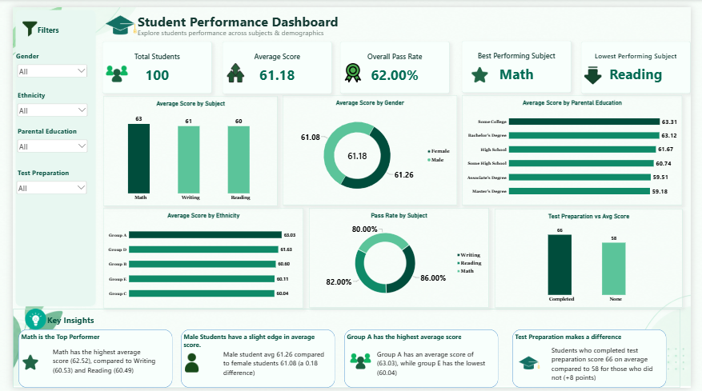

## 🎓 Student Performance Analysis Dashboard

Turning student performance data into actionable insights for better academic outcomes.

## Project Overview

Every student has a different academic journey. Some perform consistently across subjects, while others may excel in one area and struggle in another. Factors such as test preparation, parental education, gender, and ethnicity can also provide useful context for understanding academic outcomes.

This project analyzes the performance of 100 students across three core subjects:

📐 Mathematics

📖 Reading

✍️ Writing

The goal was not simply to calculate average scores, but to transform raw student data into an interactive Power BI dashboard that makes performance patterns easier to understand and provides insights that could support better academic decision-making.

The final dashboard allows users to explore performance using filters for:

Gender
Ethnicity
Parental Education
Test Preparation

## 📊 Dashboard Preview

# 🎯 Project Objective

The primary objective of this project was to answer the following questions:

1. What is the overall academic performance of the students?
 
2. Which subject has the highest average score?

3. Which subject has the lowest average score?

4. What percentage of students passed all three subjects?
 
5. How does academic performance differ by gender?
 
6. Does parental education appear to influence student performance?
 
7. How does performance vary across ethnic groups?
 
8. Does completing test preparation relate to better academic performance?
 
9. Which areas of student performance require the most attention?
 
10. How can the findings be translated into actionable recommendations?

# 📂 Dataset

The dataset contains 100 student records and the following columns:

Student ID	
Gender	
Ethnicity	
Parental Education	
Test Preparation	
Math Score	
Reading Score	
Writing Score	

The three subject scores are measured on a 0–100 scale.

For this analysis, a score of 50 or above was treated as a passing score.

# 🧹 Data Cleaning

Before building the dashboard, the dataset was reviewed and prepared using Power Query in Power BI.

The cleaning process focused on making sure the dataset was reliable and suitable for analysis.

**1. Data type validation**

The appropriate data types were applied:

Student ID → Text

Gender → Text

Ethnicity → Text

Parental Education → Text

Test Preparation → Text

Math Score → Whole Number

Reading Score → Whole Number

Writing Score → Whole Number

**2. Missing values**

The Test Preparation field contained blank values.

These values were reviewed and handled during the Power Query transformation process rather than simply deleting the affected student records.

This was important because removing students unnecessarily could distort the analysis.

**3. Score validation**

The subject score columns were checked to ensure that the values were appropriate for the expected 0–100 scoring range.

4. Duplicate checks

Student ID was reviewed to ensure that student records could be uniquely identified and that duplicate records would not distort student counts.

# 🔄 Data Transformation

After cleaning the raw data, additional analytical structures were created in Power BI.

**Subject Dimension**

Because the original dataset stored the subjects in separate columns:

Math Score
Reading Score
Writing Score

there was no single Subject column that could be used directly as a chart axis.

A separate disconnected Subjects table was therefore created using a DAX measure:

Subjects =

DATATABLE(

    "Subject", STRING,
    {
        {"Math"},
        {"Reading"},
        {"Writing"}
    }
)

# 📊 DAX Measures

Rather than creating unnecessary calculated columns, key analytical calculations were created as DAX measures.

**Total Students**

Total Students =

DISTINCTCOUNT('Sheet1'[Student ID])

Average Score

An overall student average was calculated from the three subjects:

Average Score =

AVERAGEX(

    'Sheet1',
    DIVIDE(
        'Sheet1'[Math Score] +
        'Sheet1'[Reading Score] +
        'Sheet1'[Writing Score],
        3
    )
)

This approach calculates each student's average across the three subjects before calculating the overall average.

**Subject Averages**

Separate measures were created for:

Average Math Score =

AVERAGE('Sheet1'[Math Score])

Average Reading Score =

AVERAGE('Sheet1'[Reading Score])

Average Writing Score =

AVERAGE('Sheet1'[Writing Score])

**✅ Pass Rate Analysis**

A passing score was defined as 50 or above.

The number of students passing each subject was calculated using DAX.

**Math**

Math Pass Students =

CALCULATE(

    [Total Students],
    'Sheet1'[Math Score] >= 50
)

**Reading**

Reading Pass Students =

CALCULATE(

    [Total Students],
    'Sheet1'[Reading Score] >= 50
)

**Writing**

Writing Pass Students =

CALCULATE(

    [Total Students],
    'Sheet1'[Writing Score] >= 50
)

These were then converted into pass-rate percentages.

Math Pass Rate =

DIVIDE(

    [Math Pass Students],
    [Total Students]
)

Reading Pass Rate =

DIVIDE(

    [Reading Pass Students],
    [Total Students]
)

Writing Pass Rate =

DIVIDE(

    [Writing Pass Students],
    [Total Students]
)

**🎯 Overall Pass Rate**

Instead of averaging the three subject pass rates, the analysis defined overall success as a student passing all three subjects.

Students Passed All Subjects =

COUNTROWS(

    FILTER(
        'Sheet1',
        'Sheet1'[Math Score] >= 50 &&
        'Sheet1'[Reading Score] >= 50 &&
        'Sheet1'[Writing Score] >= 50
    )
)

The overall pass rate was then calculated as:

Overall Pass Rate =

DIVIDE(

    [Students Passed All Subjects],
    [Total Students]
)

This produced an overall pass rate of 62%.

# 🏆 Performance Ranking

Measures were also created to identify the strongest and weakest-performing subjects.

**Best Performing Subject**

Best Performing Subject =

VAR MathScore = [Average Math Score]

VAR ReadingScore = [Average Reading Score]

VAR WritingScore = [Average Writing Score]

RETURN

SWITCH(

    TRUE(),
    MathScore >= ReadingScore && MathScore >= WritingScore, "Math",
    ReadingScore >= MathScore && ReadingScore >= WritingScore, "Reading",
    "Writing"
)

**Lowest Performing Subject**

Lowest Performing Subject =

VAR MathScore = [Average Math Score]

VAR ReadingScore = [Average Reading Score]

VAR WritingScore = [Average Writing Score]
RETURN

SWITCH(

    TRUE(),
    MathScore <= ReadingScore && MathScore <= WritingScore, "Math",
    ReadingScore <= MathScore && ReadingScore <= WritingScore, "Reading",
    "Writing"
)

# 📈 Dashboard Development

The dashboard was designed in Power BI with an emphasis on simplicity, interactivity, and storytelling.

**KPI Cards**

The dashboard contains five major KPIs:

👥 Total Students

📊 Average Score

🏅 Overall Pass Rate

⭐ Best Performing Subject

📉 Lowest Performing Subject

The final results show:

KPI	Result

Total Students	100

Average Score	61.18

Overall Pass Rate	62%

Best Performing Subject	Math

Lowest Performing Subject	Reading

**📊 Visual Analysis**

The dashboard contains several visualizations designed to answer different questions.

**Average Score by Subject**

This visualization compares performance across:

Math

Writing

Reading

The analysis shows that Math is the strongest-performing subject, while Reading records the lowest average score.

**Average Score by Gender**

A comparison was created between male and female students.

The dashboard shows very similar performance between both groups, suggesting that the difference in average performance is relatively small.

**Average Score by Parental Education**

This visualization explores whether parental education is associated with student performance.

Students from different parental education backgrounds show differences in average scores, making this an important demographic dimension to consider.

**Average Score by Ethnicity**

Performance was also compared across ethnic groups to identify variations and potential areas requiring further investigation.

**Pass Rate by Subject**

Pass rates were compared across Math, Reading, and Writing to determine where students were most and least successful.

**Test Preparation vs Average Score**

Finally, student performance was compared based on whether students completed test preparation.

This visualization provides one of the most important patterns in the dashboard: students who completed test preparation recorded a higher average score than students who did not.

# 🔎 Key Insights

The dashboard reveals several important findings.

**1. Math is the strongest-performing subject**

Math recorded the highest average score among the three subjects.

This suggests that students are generally performing better in Mathematics compared with Reading and Writing.

**2. Reading requires greater attention**

Reading recorded the lowest average score.

This makes Reading an important area for intervention, particularly if the goal is to improve overall student performance.

**3. Overall performance is moderate**

The overall average score is 61.18, while the overall pass rate is 62%.

This means there is still significant room for improvement, particularly among students who are currently below the passing threshold.

**4. Test preparation is associated with higher performance**

Students who completed test preparation achieved a higher average score than those who did not.

The result suggests that structured preparation may contribute positively to academic performance.

However, because this analysis is observational, the relationship should not automatically be interpreted as proof of causation.

**5. Gender performance is relatively similar**

The difference between male and female average scores is small, suggesting that gender is not the strongest differentiating factor in this dataset.

**6. Demographic differences exist**

Differences can be observed across parental education and ethnic groups.

These differences should be used as signals for further investigation rather than assumptions about individual students.

# 💡 Recommendations

Based on the findings, the following actions are recommended:

**1. Strengthen Reading support**

Since Reading is the lowest-performing subject, schools could introduce:

a. Additional reading sessions
   
b. Comprehension exercises

c. Vocabulary-building activities
 
d. Targeted support for students below the passing mark

**2. Encourage test preparation**

Since students who completed test preparation performed better, schools could make structured preparation resources more accessible.

This could include:

a. Practice tests

b. Revision materials

c. Study guides

d. Revision sessions

e. Time-management strategies

**3. Provide targeted student intervention**

Rather than applying the same strategy to every student, educators should identify students performing below 50 and provide targeted support.

**4. Monitor performance across subjects**

Students who perform well in Math but poorly in Reading, for example, may benefit from subject-specific intervention rather than general academic support.

**5. Use demographic insights responsibly**

Differences across gender, ethnicity, and parental education should be monitored to identify potential support needs, while avoiding assumptions about individual students based solely on demographic characteristics.

**6. Track performance over time**

Future versions of the dashboard should include assessment dates or academic periods.

This would allow educators to monitor:

a. Month-to-month improvement

b. Term-to-term performance

c. Improvement after interventions

d. Changes in pass rates

e. Progress of individual students

# 📌 Conclusion

This project demonstrates how raw student records can be transformed into an interactive analytical tool that tells a meaningful story.

The analysis moves from:

**Raw Data → Cleaning → Transformation → DAX → Visualization → Insights → Recommendations**

The dashboard shows that while students demonstrate relatively stronger performance in Mathematics, Reading remains an area requiring additional attention. The analysis also highlights a positive association between test preparation and average performance, while demographic differences provide additional context for understanding student outcomes.

Ultimately, the goal of the dashboard is not just to display numbers, but to help educators and decision-makers understand where students are performing well, where support is needed, and what actions could improve academic outcomes.

## 📊 Power BI Report

Want to explore the dashboard and see the work behind the analysis?

👉 **[Download the Power BI (.pbix) file](./Students_Performance_Dashboard.pbix)**

Open the file in **Microsoft Power BI Desktop** to explore the data model, DAX measures, transformations, interactive filters, and dashboard design.
